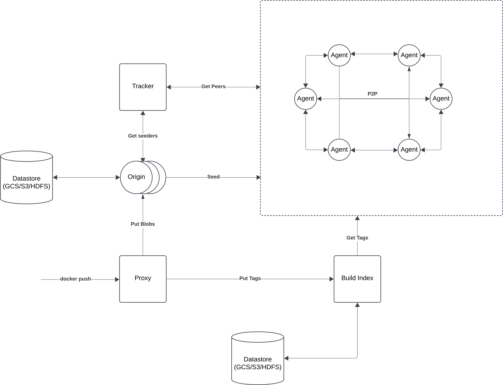
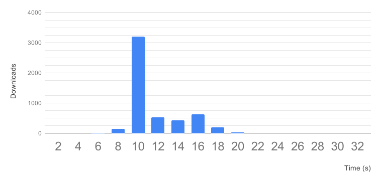

<p align="center"></p>

<p align="center">
</a>
<a href="https://travis-ci.com/uber/kraken"></a>
<a href="https://github.com/uber/kraken/releases"></a>
<a href="https://godoc.org/github.com/uber/kraken"></a>
<a href="https://goreportcard.com/badge/github.com/uber/kraken"></a>
<a href="https://codecov.io/gh/uber/kraken"></a>
</p>

Kraken is a P2P-powered Docker registry that focuses on scalability and availability. It is
designed for Docker image management, replication, and distribution in a hybrid cloud environment.
With pluggable backend support, Kraken can easily integrate into existing Docker registry setups
as the distribution layer. 

Kraken has been in production at Uber since early 2018. In our busiest cluster, Kraken distributes
more than 1 million blobs per day, including 100k 1G+ blobs. At its peak production load, Kraken
distributes 20K 100MB-1G blobs in under 30 sec.

Below is the visualization of a small Kraken cluster at work:

<p align="center">
  
</p>

# Table of Contents

- [Features](#features)
- [Design](#design)
- [Architecture](#architecture)
- [Benchmark](#benchmark)
- [Usage](#usage)
- [Comparison With Other Projects](#comparison-with-other-projects)
- [Limitations](#limitations)
- [Contributing](#contributing)
- [Contact](#contact)

# Features

Following are some highlights of Kraken:
- **Highly scalable**. Kraken is capable of distributing Docker images at > 50% of max download
  the speed limit on every host. Cluster size and image size do not have a significant impact on
  download speed.
  - Supports at least 15k hosts per cluster.
  - Supports arbitrarily large blobs/layers. We normally limit max size to 20G for the best performance.
- **Highly available**. No component is a single point of failure.
- **Secure**. Support uploader authentication and data integrity protection through TLS.
- **Pluggable storage options**. Instead of managing data, Kraken plugs into reliable blob storage
  options, like S3, GCS, ECR, HDFS or another registry. The storage interface is simple and new
  options are easy to add.
- **Lossless cross-cluster replication**. Kraken supports rule-based async replication between
  clusters.
- **Minimal dependencies**. Other than pluggable storage, Kraken only has an optional dependency on
  DNS.

# Design

The high-level idea of Kraken is to have a small number of dedicated hosts seeding content to a
network of agents running on each host in the cluster.

A central component, the tracker, will orchestrate all participants in the network to form a
pseudo-random regular graph.

Such a graph has high connectivity and a small diameter. As a result, even with only one seeder and
having thousands of peers joining in the same second, all participants can reach a minimum of 80%
max upload/download speed in theory (60% with current implementation), and performance doesn't
degrade much as the blob size and cluster size increase. For more details, see the team's [tech
talk](https://www.youtube.com/watch?v=waVtYYSXkXU) at KubeCon + CloudNativeCon.

# Architecture



- Agent
  - Deployed on every host
  - Implements Docker registry interface
  - Announces available content to tracker
  - Connects to peers returned by the tracker to download content
- Origin
  - Dedicated seeders
  - Stores blobs as files on disk backed by pluggable storage (e.g. S3, GCS, ECR)
  - Forms a self-healing hash ring to distribute the load
- Tracker
  - Tracks which peers have what content (both in-progress and completed)
  - Provides ordered lists of peers to connect to for any given blob
- Proxy
  - Implements Docker registry interface
  - Uploads each image layer to the responsible origin (remember, origins form a hash ring)
  - Uploads tags to build-index
- Build-Index
  - Mapping of the human-readable tag to blob digest
  - No consistency guarantees: the client should use unique tags
  - Powers image replication between clusters (simple duplicated queues with retry)
  - Stores tags as files on disk backed by pluggable storage (e.g. S3, GCS, ECR)

# Benchmark

The following data is from a test where a 3G Docker image with 2 layers is downloaded by 2600 hosts
concurrently (5200 blob downloads), with 300MB/s speed limit on all agents (using 5 trackers and
5 origins):



- p50 = 10s (at speed limit)
- p99 = 18s
- p99.9 = 22s

# Usage

All Kraken components can be deployed as Docker containers. To build the Docker images:
```
$ make images
```
For information about how to configure and use Kraken, please refer to the [documentation](docs/CONFIGURATION.md).

## Kraken on Kubernetes

You can use our example Helm chart to deploy Kraken (with an example HTTP fileserver backend) on
your k8s cluster:
```
$ helm install --name=kraken-demo ./helm
```
Once deployed, every node will have a docker registry API exposed on `localhost:30081`.
For example pod spec that pulls images from Kraken agent, see [example](examples/k8s/demo.json).

For more information on k8s setup, see [README](examples/k8s/README.md).

## Devcluster

To start a herd container (which contains origin, tracker, build-index and proxy) and two agent
containers with development configuration:
```
$ make devcluster
```

Docker-for-Mac is required for making dev-cluster work on your laptop.
For more information on devcluster, please check out devcluster [README](examples/devcluster/README.md).

# Comparison With Other Projects

## Dragonfly from Alibaba

Dragonfly cluster has one or a few "supernodes" that coordinates the transfer of every 4MB chunk of data
in the cluster.

While the supernode would be able to make optimal decisions, the throughput of the whole cluster is
limited by the processing power of one or a few hosts, and the performance would degrade linearly as
either blob size or cluster size increases.

Kraken's tracker only helps orchestrate the connection graph and leaves the negotiation of actual data
transfer to individual peers, so Kraken scales better with large blobs.
On top of that, Kraken is HA and supports cross-cluster replication, both are required for a
reliable hybrid cloud setup.

## BitTorrent

Kraken was initially built with a BitTorrent driver, however, we ended up implementing our P2P
driver based on BitTorrent protocol to allow for tighter integration with storage solutions and more
control over performance optimizations.

Kraken's problem space is slightly different than what BitTorrent was designed for. Kraken's goal is
to reduce global max download time and communication overhead in a stable environment, while
BitTorrent was designed for an unpredictable and adversarial environment, so it needs to preserve more
copies of scarce data and defend against malicious or bad behaving peers.

Despite the differences, we re-examine Kraken's protocol from time to time, and if it's feasible, we
hope to make it compatible with BitTorrent again.

# Limitations

- If Docker registry throughput is not the bottleneck in your deployment workflow, switching to
Kraken will not magically speed up your `docker pull`. To speed up `docker pull`, consider
switching to [Makisu](https://github.com/uber/makisu) to improve layer reusability at build time, or
tweak compression ratios, as `docker pull` spends most of the time on data decompression.
- Mutating tags (e.g. updating a `latest` tag) is allowed, however, a few things will not work: tag
lookups immediately afterwards will still return the old value due to Nginx caching, and replication
probably won't trigger. We are working on supporting this functionality better. If you need tag
mutation support right now, please reduce the cache interval of the build-index component. If you also need
replication in a multi-cluster setup, please consider setting up another Docker registry as Kraken's
backend.
- Theoretically, Kraken should distribute blobs of any size without significant performance
degradation, but at Uber, we enforce a 20G limit and cannot endorse the production use of
ultra-large blobs (i.e. 100G+). Peers enforce connection limits on a per blob basis, and new peers
might be starved for connections if no peers become seeders relatively soon. If you have ultra-large
blobs you'd like to distribute, we recommend breaking them into <10G chunks first.

# Contributing

Please check out our [guide](docs/CONTRIBUTING.md).

# Contact

To contact us, please join our [Slack channel](https://join.slack.com/t/uber-container-tools/shared_invite/enQtNTIxODAwMDEzNjM1LWIwYzIxNmUwOGY3MmVmM2MxYTczOTQ4ZDU0YjAxMTA0NDgyNzdlZTA4ZWVkZGNlMDUzZDA1ZTJiZTQ4ZDY0YTM).
