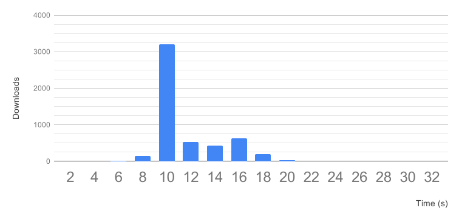

# Kraken :octopus:

Kraken is highly scalable P2P blob distribution system for large docker images and content addressable blobs.

Some highlights of Kraken:
- Highly scalable. It's capable of distributing docker images at throughput of 1TB/sec, and image size doesn't impact download speed. It can support clusters of 8k hosts and above.
- Highly available. Kraken cluster would remain operational even if mutiple origin hosts were lost at the same time.
- Secure. Supports bi-directional TLS between all components for image tags, and bi-directional TLS between image builder and Kraken for all data (if your image builder supports client-side TLS, like [Makisu](https://github.com/uber/makisu)).
- Pluggable. It supports using S3/HDFS as storage backend, and it's easy to add more storage drivers. It can be setup as write-back cache with configurable TTL, so it can survive S3 outages without impacting functionality.
- Lossless cross cluster replication. Kraken supports async replication between clusters based on namespace and repo name.
- Minimal dependency. Other than plugable storage, Kraken only depends on DNS.

# Design
Visualization of a small Kraken cluster at work:

The high level idea of Kraken, is to have a 3~5 node dedicated seeder cluster (origin) backed by S3/GCS/HDFS, and a agent with docker registry interface on every host, then let a central component (tracker) instruct seeders and agents to form a pseudo-random regular graph. In such a graph, all participants can reach > 75% of max upload/download speed no matter how big the file is, and performance doesn't degrade much as cluster size increases.

# Artitecture

Kraken have multiple components, they are divided into components that's dedicated to P2P distribution of content addressable blobs within a cluster, and components that's used for docker image upload and cross cluster replication.

## Kraken Core

Central P2P components that's not specific to docker images:

- Agent
  - Deployed on every host
  - Implements Docker registry interface
- Origin
  - Dedicated seeders
  - Pluggable storage backend (e.g. S3)
  - Self-healing hash ring
- Tracker
  - Tracks peers and seeders, instructs them to form a sparse graph
  - Self-healing hash ring

## Kraken Proxy and Build Index

Components responsible for image tags and replication to other clusters.

- Proxy
  - Handled image upload and direct download
  - Contains Nginx internally
- Build Index
  - Mapping of human readable tag to blob hash (digest)
  - No consistency guarantees, client should use unique tags
  - Powers image replication between clusters. Simple duplicated queues with retry
  - Pluggable storage
  - Self-healing hash ring

# Benchmark

Download a 3G docker image with 2 layers onto 2600 hosts concurrently (5200 blob downloads), with 300MB/s speed limit on all agents, 5 trackers and 5 origins:

- p50 = 10s (At speed limit)
- p99 = 18s
- p99.9 = 22s

# Usage

# Limitations

- If docker registry throughput wasn't the bottleneck, switching to Kraken wouldn't speed up `docker pull` by much, because docker spends most of the time on data decompression. To actually speed up `docker pull`, consider switching to [Makisu](https://github.com/uber/makisu) to tweak compression ratio at build time, and then use Kraken to distribute the uncompressed image, at the cost of additional IO.
- Kraken's cross cluster replication mechanism cannot handle tag mutation (handling that properly would require a globally consistent key-value store). If that's required, please consider implementing your own index component on top of your prefered key-value store solution.
- Kraken is supposed to work with blobs of any size, and download speed wouldn't be impacted by blob size. However, as blobs grow bigger, GC and replication gets more expensive too, and could produce hotspot in origin cluster. In practice it's better to devide extra large blobs into <10G chunks.
