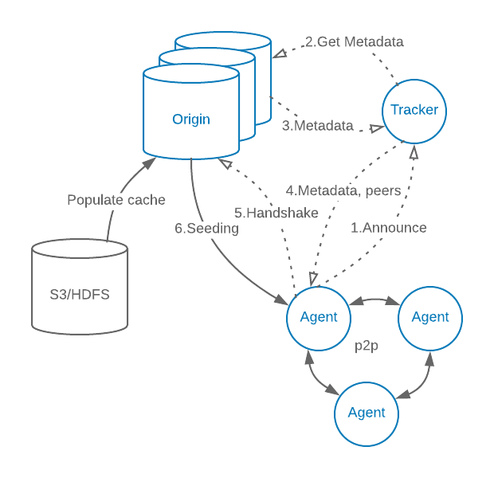
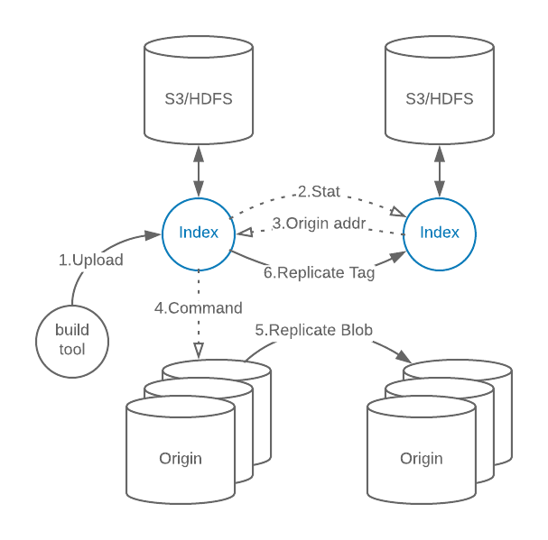

# Kraken :octopus:

Kraken is highly scalable P2P blob distribution system for docker images and content addressable blobs.

Some highlights of Kraken:
- Highly scalable. It's capable of distributing docker images at speed of 1TB/sec, and image size doesn't impact download speed. It supports 8k host clusters without problem.
- Highly available. Kraken cluster would remain operational even if mutiple origin hosts were lost at the same time.
- Secure. Supports bi-directional TLS between all components for image tags, and bi-directional TLS between image builder and Kraken for all data (if your image builder supports client-side TLS, like [Makisu](https://github.com/uber/makisu)).
- Pluggable. It supports using S3/HDFS as storage backend, and it's easy to add more storage drivers. It can be setup as write-back cache, so it can survive S3 outages wihtout impacting functionality.
- Lossless cross cluster replication. Kraken supports async replication between clusters based on namespace and repo name.
- Minimal dependency. Other than plugable storage, Kraken only depends on DNS.

# Design
Visualization of a small Kraken cluster at work:

The high level idea of Kraken, is to have a 3~5 host dedicated seeder cluster (origin) backed by S3/GCS/HDFS, and deploy a agent with docker registry interface on every host, then let a central component (tracker) instruct seeders and agents to form a pseudo-random regular graph. In such a graph, all participants can exchange pieces of data blobs randomly, and reach > 80% of max upload/download speed no matter how big the file is, and doesn't degrade much as cluster size increase.

# Artitecture

Kraken have multiple components, they are divided into components that's dedicated to P2P distribution of content addressable blobs within a cluster, and components that's used for docker image upload and cross cluster replication.

## Kraken Core

Central P2P components that's not specific to docker images:

- Agent
  - Deployed on every host
  - Implements Docker registry interface
- Origin
  - Dedicated seeders
  - Pluggable storage backend (e.g. S3)
  - Self-healing hash ring
- Tracker
  - Tracks peers and seeders, instructs them to form a sparse graph
  - Self-healing hash ring

## Kraken Build Index and Replication

Components responsible for image tags and replication to other clusters.

- Proxy
  - Handled image upload and direct download
  - Contains Nginx internally
- Build Index
  - Mapping of human readable tag to blob hash (digest)
  - No consistency guarantees, client should use unique tags
  - Powers image replication between clusters. Simple duplicated queues with retry
  - Pluggable storage
  - Self-healing hash ring
