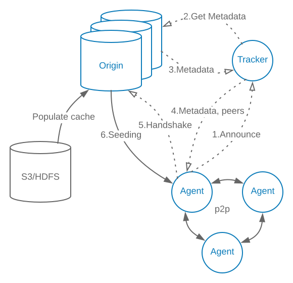

# Kraken Core

Central P2P components that's not specific to docker images:

## Agent
  - Deployed on every host
  - Implements Docker registry interface

## Origin
  - Dedicated seeders
  - Pluggable storage backend (e.g. S3)
  - Self-healing hash ring

## Tracker
  - Tracks peers and seeders, instructs them to form a sparse graph
  - Self-healing hash ring

# Kraken Proxy and Build Index

Components responsible for image tags and replication to other clusters:

## Proxy
  - Handles image upload and direct download

## Build Index
  - Mapping of human readable tag to blob hash (digest)
  - No consistency guarantees, client should use unique tags
  - Powers image replication between clusters. Simple duplicated queues with retry
  - Pluggable storage
  - Self-healing hash ring
