# Lazy-Pull Streaming — Cross-Stack Architecture Review

## 1. Purpose

`docs/lazy-pull-streaming-production-plan.md` specifies a 19-PR stack across
agent, origin, tracker, proxy, and build-index. This doc reviews that stack
end to end for one thing the PR-by-PR format doesn't surface well: places
where two PRs (or a PR and existing code) solve the same problem twice. It
also gives an old-vs-new architecture diagram for every component the stack
touches, split per sub-concern where a component has more than one, and
records the alternatives considered and rejected for every change — not just
the cold-origin-metainfo tradeoff the production plan already covers in its
own §7.3.

This doc complements `production-plan.md`; it does not replace any of its PR
specs. Where a merge described here changes a PR's declarations, the
authoritative spec still lives in `production-plan.md` (already updated in
place for the one fix found here that needed it — see §2.4).

## 2. Duplication audit

### 2.1 Already merged in the production plan

Two duplications were found and designed out while writing Stack B itself;
they're recapped here for completeness, not redesigned.

**Origin's two blob stores.** `CAStore` (warm blobs) and `CADownloadStore`
(cold-fetched partial blobs) were two separate types with two separate cache
directories. `CAStore` now gains a third `download` state sharing the same
backend/directory as its existing `cache` state, so a fully-fetched partial
blob promotes into the same store instead of sitting duplicated in a second
one. See `production-plan.md` §7 preamble and B3.

**Origin's two fetch engines for the same digest.** The P2P scheduler's
per-piece fetch and `blobserver`'s plain-HTTP whole-blob fetch
(`blobRefresher.Refresh`) ran as fully independent fetches against the same
backend object. `Refresher.TriggerBackground` now reuses the existing
`dedup.RequestCache` to route both onto the scheduler's one shared `*Torrent`
per digest, so a P2P fetch and an HTTP fetch for the same cold blob can never
duplicate backend work. See `production-plan.md` B5.

### 2.2 New merge: shared piece-state machine

`lib/torrent/storage/originstorage/pieces.go` (B3a) is a near-verbatim copy
of `lib/torrent/storage/agentstorage/pieces.go` — same `pieceStatus` enum,
`piece` struct, `tryMarkDirty`, `markEmpty`/`markComplete`,
`pieceStatusMetadata`, `restorePieces`. B3a's own description in
`production-plan.md` says the origin version is "adapted from
`agentstorage/pieces.go`" — i.e. it plans to copy-paste this a second time.

The bookkeeping type should live in one shared package
(`lib/torrent/storage/piecestate`, or similar), imported by both packages.
The *behavior built on top* of that bookkeeping legitimately differs and
should stay separate: agent's `WritePiece` fails fast on contention
(`errWritePieceConflict`) because the scheduler's dispatcher already
centrally assigns which peer gets which piece; origin's
`GetPieceReader`/`ensurePiece` blocks and polls (`waitForPiece`) because
concurrent HTTP handlers have no central coordinator. Only the piece/status
bookkeeping needs to move, not the wrapping logic.

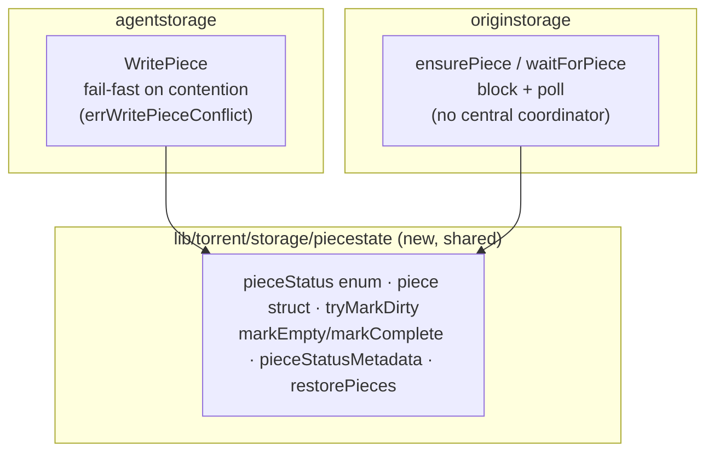

**Alternatives considered:**
- *Leave the two copies as-is.* Rejected — every future change to piece
  bookkeeping (e.g. adding a new `pieceStatus` value) has to land twice,
  correctly, in two packages with no compiler tie between them.
- *Merge the wrapping behavior too (one `ensurePiece`-shaped function used by
  both).* Rejected — agent's fail-fast and origin's block-and-poll are
  different concurrency contracts driven by different callers (a centrally
  scheduled dispatcher vs. uncoordinated concurrent HTTP handlers); forcing
  one shape on both would mean either agent starts polling unnecessarily or
  origin starts failing fast and needs its own retry wrapper anyway.

### 2.3 New merge: shared retry-on-202 backoff loop

`origin/blobclient/cluster_client.go`'s `Poll` and
`tracker/metainfoclient/client.go`'s `PollAccepted` are near-duplicate
implementations of the same "sleep on 202, try again" loop
(`cluster_client.go:381-390` vs. `httputil.go:406-416` — same
`NextBackOff`/`backoff.Stop`/`time.Sleep` shape). They differ only in
fan-out: `Poll` retries across N resolved origin hosts with failover;
`PollAccepted` retries a single URL. `metainfoclient` also hardcodes its own
`backoff.ExponentialBackOff` literal instead of building it through the
`httputil.ExponentialBackOffConfig` helper every other backend client in the
repo uses.

The inner retry-on-202 loop should be one shared helper in `utils/httputil`
that `Poll` wraps per-candidate-host and `metainfoclient.Client.Download`
calls directly for its single host, with `metainfoclient` switched onto the
existing `ExponentialBackOffConfig` builder instead of a second hardcoded
literal. This is the same "an existing retry mechanism already solves this,
reuse it" move Stack A's A11 already makes for the new range-download client
— A11 reuses `Poll` itself; this merge reuses `Poll`'s *inner loop* one level
down, for a caller A11 doesn't touch.

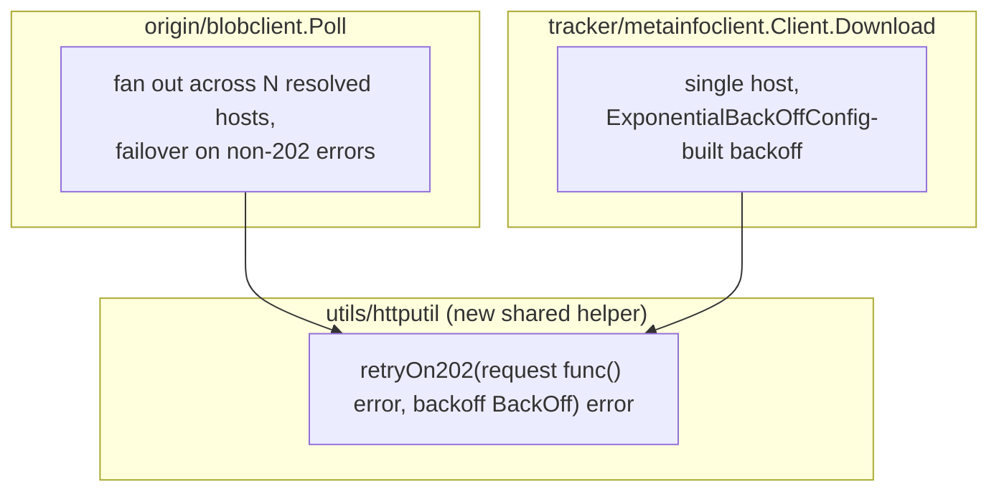

**Alternatives considered:**
- *Leave `PollAccepted` as its own thing.* Rejected — it's the same loop with
  a different backoff literal typed in by hand; a bug fix to the retry
  condition (e.g. also retrying on a specific 5xx) would need to land twice.
- *Have `metainfoclient` call `origin/blobclient.Poll` directly instead of
  extracting a shared helper.* Rejected — `Poll` is multi-host-shaped
  (`ClientResolver`), and `metainfoclient` only ever talks to one host;
  forcing it through `Poll`'s resolver abstraction for a single-host case
  adds an unnecessary interface implementation rather than removing code.
- `SendRetry`'s generic 5xx/network retry is a different problem (transient
  failure vs. async-processing-in-progress) and isn't part of this merge.

### 2.4 Regression fix: gate B2's sidecar upload to blob tasks only

**Already applied to `production-plan.md`'s B2 section** — this recap is for
completeness. `lib/persistedretry/writeback.Executor` is one shared type
constructed by both origin (`origin/cmd/cmd.go:222`, for blob writeback) and
build-index (`build-index/cmd/cmd.go:215`, for tag writeback,
`writeback.NewTaskWithContext(ctx, tag, tag, writeBackDelay)` — the task's
`Name`/`Namespace` are a tag string, not a digest). B2's
`uploadMetaInfoSidecar` (`executor.go:205,228`) was unconditional: it calls
`e.fs.GetCacheFileMetadata(t.Name, &tm)` expecting a piece-based
`TorrentMeta`, which will never exist for a tag name — the `os.IsNotExist`
branch is coded as retryable, so every tag writeback would fail and retry
forever. `writeback.NewExecutor` now takes a `writeSidecar bool` (true for
origin's instance, false for build-index's), gating the call.

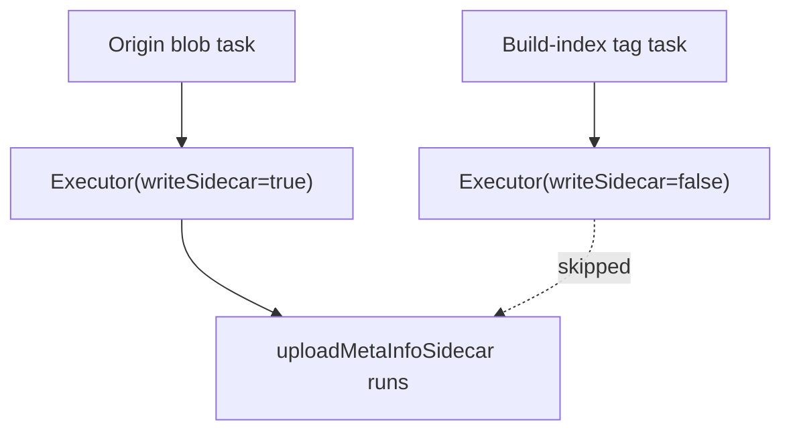

**Alternatives considered:**
- *Add a `Kind` field to `writeback.Task` (blob vs. tag) and gate per-task.*
  Rejected — the decision is per-executor-instance, never mixed within one
  process (origin's executor only ever handles blob tasks, build-index's
  only ever handles tag tasks), so a per-task field would carry the same
  value on every call for no benefit over a constructor flag.
- *Detect "is this a tag" structurally (e.g. by namespace format).* Rejected
  — fragile; a constructor flag set once at wiring time can't drift out of
  sync with what the executor is actually used for.

### 2.5 Design correction: Stack D's bitfield wire format

Not a code fix — Stack D's D1 isn't built yet, so this is a correction to
its plan before it ships. D1 proposes `PeerInfo.Bitfield []bool`, explicitly
avoiding a `bitset` import into `core` for now, with an acknowledged TODO to
"pack" it before production. But the agent-to-agent dispatch handshake
already has a compact, real bitfield wire format:
`github.com/willf/bitset.BitSet`'s own `MarshalBinary`/`UnmarshalBinary`
(`lib/torrent/scheduler/conn/handshaker.go:29-46`,
`lib/torrent/storage/torrent_info.go:63-65`). If D1's future "packing" fix
doesn't converge on that exact encoding, Kraken ends up with three bitfield
wire formats: bitset-binary (agent↔agent), raw `[]bool` (tracker↔agent, D1's
first cut), and a third "packed" format whenever someone gets to the TODO.

D1 should serialize `PeerInfo.Bitfield` using `bitset.BitSet.MarshalBinary()`
from day one — stored/transmitted as `[]byte`, `omitempty` — removing the
acknowledged TODO instead of deferring it.

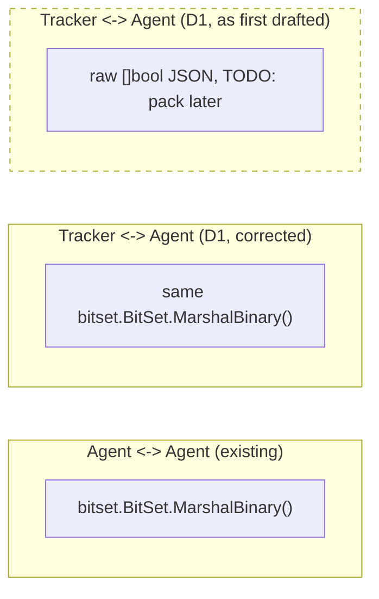

**Alternatives considered:**
- *Ship D1 with raw `[]bool` now, pack it in a follow-up PR.* Rejected —
  this is exactly the path that risks a third encoding; there's no reason to
  defer when the compact encoding already exists and is already a dependency
  of the same binary.
- *Invent a new packed format specific to the tracker wire protocol.*
  Rejected — would still be a second encoding alongside `bitset`'s existing
  one for the identical concept (a peer's have-set), with no stated
  advantage over reusing it.

### 2.6 Considered and rejected (cross-cutting)

- **Torrent-level dedup (`torrentControls[InfoHash]`) vs. blob-level dedup
  (`dedup.RequestCache`).** Different granularities (whole torrent identity
  vs. one digest's backend fetch) and different lifecycles (event-loop-
  confined in-memory map vs. a TTL'd request cache with cached errors). Not
  merged.
- **Piece-level blocking wait (`tryMarkDirty`+`waitForPiece`'s hand-rolled
  50ms-poll/2min-timeout loop) vs. `dedup.RequestCache`'s non-blocking
  "pending, retry later" contract.** Genuinely different delivery contracts:
  the piece-level caller must synchronously get real bytes back for the
  current HTTP response; `RequestCache` deliberately never blocks a caller or
  hands back a leader's result to a waiter. A `singleflight`-style blocking
  primitive would technically unify the shape of both, but none exists in
  the repo today, and introducing one to replace working, contained,
  origin-only code is a larger and riskier change than the piece-bookkeeping
  merge in §2.2, which is independent of this. Recorded as a real candidate
  for later, not acted on now.
- **Four-layer metainfo resolution waterfall** (local `TorrentMeta` cache →
  cold backend `/kmeta` sidecar → trigger full download → serve to a remote
  `tracker/metainfoclient` caller). Each layer addresses a different storage
  medium and cache lifetime. Not duplication; not merged.

## 3. Agent

### 3.1 Registry read path

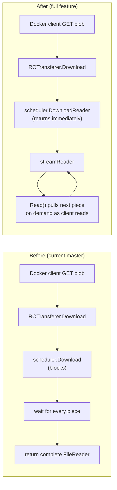

**Alternatives considered:**
- *Keep `Download` blocking and add a separate streaming method.* Rejected —
  `store.FileReader` and the new `BlobReader` have identical method sets, so
  `ReadOnlyTransferer.Download`'s existing signature and callers don't need
  to change at all; a second method would be a distinction without a
  difference.
- *A fixed-size prefetch buffer instead of true on-demand piece pulls.*
  Rejected — reintroduces a "wait for N pieces" blocking window, which is
  exactly what this change removes; genuinely on-demand (via `demand`/
  `acquirePiece`) has no such window.

### 3.2 Piece write/state tracking

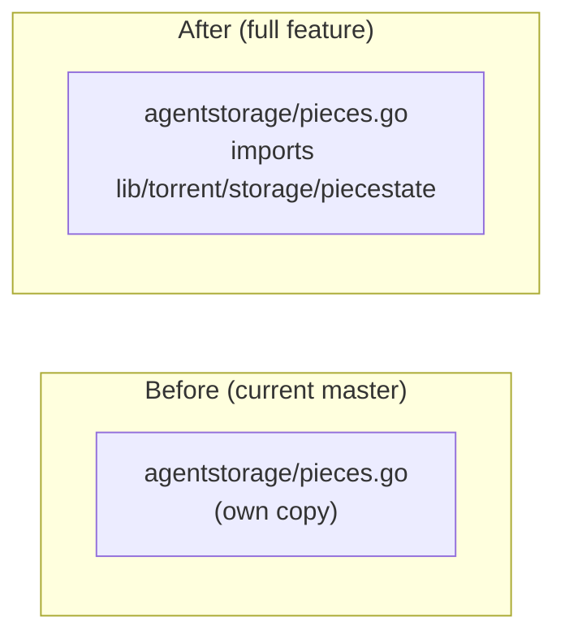

**Alternatives considered:** see §2.2 (this is the agent-side half of that
cross-cutting merge; the alternatives are the same).

### 3.3 Stream-aware priority

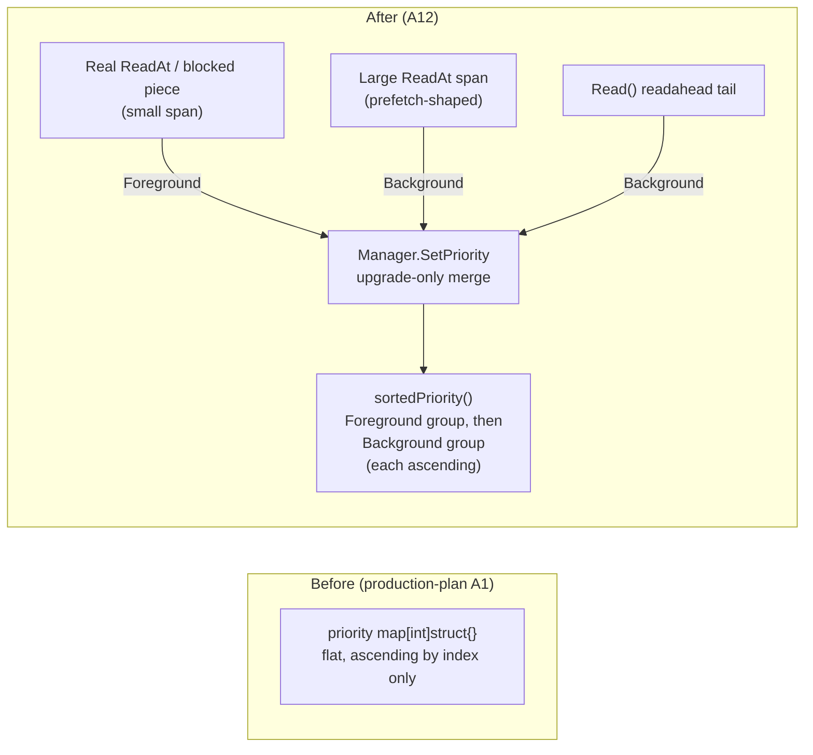

`docs/lazy-pull-streaming-critical-review.md`'s finding that the flat,
ascending-sorted `priority` map has no per-stream or "currently blocked
piece" classification is addressed in production-plan.md §5.3 A12: pieces are
now tagged `Foreground` (the piece a read is actually blocked on, or a small
`ReadAt` span) or `Background` (a stream's own speculative readahead tail, or
a large `ReadAt` span shaped like a snapshotter prefetch call), upgrade-only,
and `sortedPriority()` always serves the whole Foreground group ahead of the
whole Background group regardless of piece index.

The classification is inferred from request shape, not a wire signal —
verified there is none: containerd's `Prepare` snapshot labels are
mount-granularity, and stargz-snapshotter issues prefetch and on-demand
reads as plain, indistinguishable Range GETs. The two-tier split instead
mirrors an asymmetry the snapshotter's own client already encodes internally
(`PrefetchTimeoutSec`=10s, low-patience/disposable vs. `FetchTimeoutSec`=300s,
high-patience/must-succeed) — Kraken's tiers rank the same way rather than
inventing an orthogonal scheme.

**Alternatives considered:**
- *Per-stream fairness (a stable identity object per `streamReader`, plumbed
  through `SetPriorityPiece`/`RequestPieces`/`Manager`).* Rejected for now —
  nothing in the actual snapshotter access pattern needs true per-stream
  fairness, only a foreground/background split; `streamReader` has no stable
  identity today, so this is materially bigger plumbing for no demonstrated
  benefit. Left as future work if size-based classification proves
  insufficient.
- *Classify by wall-clock timing (early-after-mount = prefetch) instead of
  span size.* Rejected — requires coordinating a mount-time reference clock
  into the scheduler for no added precision; span size alone already
  reliably distinguishes a real FUSE read (page/block-sized) from an
  aggregate prefetch span (tens of MB) without any new state.
- *Fix the stream-abandonment priority leak in the same change.* Rejected —
  out of scope for the reservation-ordering bug actually reported; disclosed
  as a residual, scoped-out ceiling in production-plan.md §5.3 A12 instead
  of silently expanding this PR.

## 4. Origin

### 4.1 Disk/store

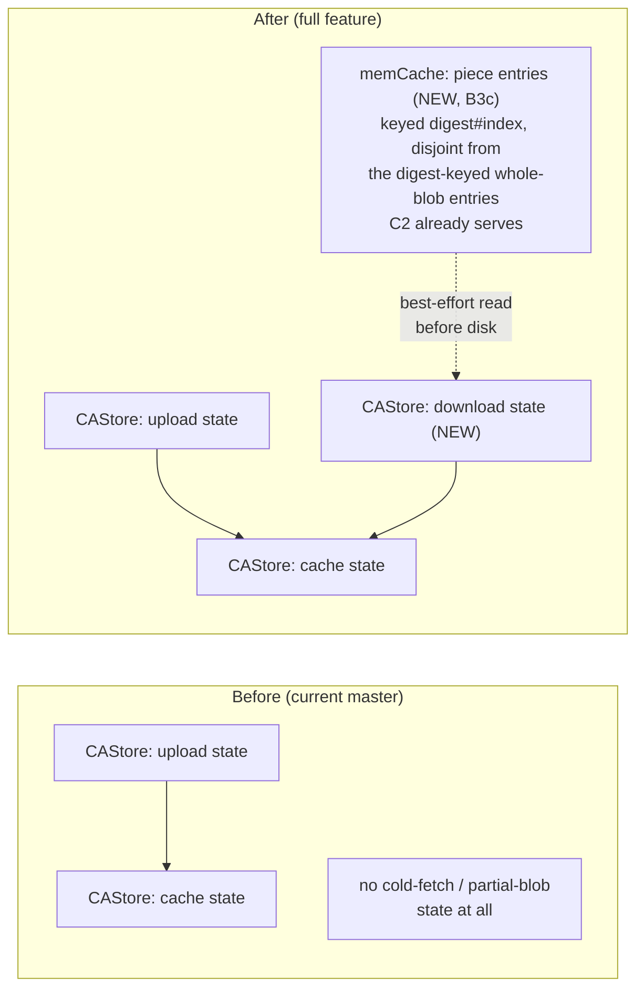

Master has no notion of a partial or cold-fetched blob at all — `CAStore`
today only has `upload` and `cache` states. An earlier design pass
considered adding that as a second type, `CADownloadStore`, with its own
cache directory; that design was rejected before any code landed on it, in
favor of adding `download` as a third state directly on the existing
`CAStore`, promoted into `cache` the same way `upload` already is.

**Invariant:** `GetCacheFileReader`/`GetCacheFileStat`/`GetCacheFileMetadata`
resolve cache-state and whole-blob memcache only, keyed by bare
`digest.Hex()` — never a download-state file, and never a B3c piece-cache
entry (those are keyed `digest#index`, a format that can never collide with
a bare digest key). An incomplete download-state blob must never be
observable as a complete cache-state blob through any of these APIs.

**Alternatives considered:** see `production-plan.md` §7 preamble and B3 —
a separate `CADownloadStore` type (its own directory, its own promotion
path) was the first design considered and was rejected in favor of a third
state on the existing `CAStore`; the promotion pattern
(`MoveDownloadFileToCache`) directly mirrors the existing
`MoveUploadFileToCache`, so no new promotion mechanism was invented either.
B3c's piece cache reuses the existing whole-blob `memCache` instance rather
than standing up a second cache with its own capacity/TTL config — the two
key formats (bare digest vs. `digest#index`) can never collide, so one cache
instance safely serves both purposes.

### 4.2 Dedup/fetch-session

```mermaid
flowchart TB
    subgraph before["Before (current master)"]
        P1["P2P peer piece request"] --> S1["scheduler dispatcher\ntryMarkDirty"]
        H1["Plain HTTP GET blob"] --> R1["blobRefresher.Refresh\n(independent fetch)"]
        S1 --> BE1[("backend")]
        R1 --> BE1
    end
    subgraph after["After (full feature, scoped dedup)"]
        P2["P2P peer piece request"] --> T2["shared *Torrent\ntryMarkDirty"]
        H2A["Plain HTTP GET (whole blob)"] --> TB2A["TriggerBackground\nscope=\"\" (digest only)"]
        H2B["Range request A [offset,length)"] --> TB2B["TriggerBackground\nscope=\"3-5\""]
        H2C["Range request B (disjoint span)"] --> TB2C["TriggerBackground\nscope=\"40-41\""]
        TB2A --> DR2A["sched.DownloadReader"] --> T2
        TB2B --> DR2B["sched.DownloadReader"] --> T2
        TB2C --> DR2C["sched.DownloadReader"] --> T2
        T2 --> BE2[("backend, one fetch per piece")]
    end
```

Scope is `pieceRangeScope(offset, length)`, resolved via the already-cheap
`Scheduler.Stat` (metainfo-only, no torrent created). The three
`TriggerBackground` calls above are three distinct `dedup.RequestCache` keys,
so a whole-blob request and two disjoint range requests for the *same*
digest no longer collide on one dedup slot — each proceeds independently
instead of the second/third waiting a retry round-trip for the first's slot
to free. Identical or overlapping scopes still coalesce onto one goroutine
(unchanged from before); `tryMarkDirty` inside the shared `*Torrent` is
untouched and remains the actual per-piece fetch dedup, so two goroutines
racing on the same underlying piece still only fetch it once regardless of
how many `TriggerBackground` slots are in flight.

**Alternatives considered:** already recorded in `production-plan.md`'s B5
section — the blocking `sched.Download` and synchronous `io.Copy`-in-handler
approaches were both tried and rejected before landing on
`TriggerBackground`. A `digest+range`-keyed second dedup layer was
originally considered *and rejected* here, reasoning it would just duplicate
what `tryMarkDirty` already does more precisely for overlapping-but-not-
identical ranges. That reasoning holds for the overlapping case, but missed
the actual motivating scenario: *disjoint* ranges of the same digest, which
`tryMarkDirty` never touches at all (it dedupes piece fetches, not
request-orchestration slots) — under a snapshotter workload issuing many
small, scattered range reads against one layer, disjoint requests colliding
on a single per-digest `TriggerBackground` slot is a real, repeated retry
cost, not an edge case. Reversed: a `digest+piece-range`-keyed scope is now
adopted (production-plan.md §7.2, B5). `tryMarkDirty` is unchanged and still
owns per-piece correctness; the two mechanisms operate at different layers
and both are needed.

### 4.3 Client-side retry

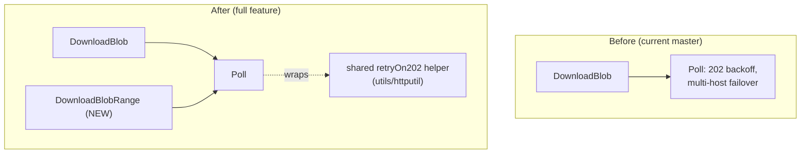

**Alternatives considered:** already recorded in this session's earlier work
on A11 — reusing `Poll` directly for the new range client rather than
writing a second retry loop. See §2.3 for the further extraction of `Poll`'s
own inner loop into a helper shared with `tracker/metainfoclient`.

### 4.4 Piece-fetch concurrency

`RangeDownloader.DownloadRange` shares one backend worker pool with
whole-object `Download` (`transfermanager.NewDownloader(..., WithWorkers(N))`
in the GCS client) — that pool parallelizes *across* concurrent calls to it,
not only by internally sharding one large call. A single piece is too small
to shard on its own, so all of a fetch's throughput comes from how many
pieces origin submits to that pool at once.

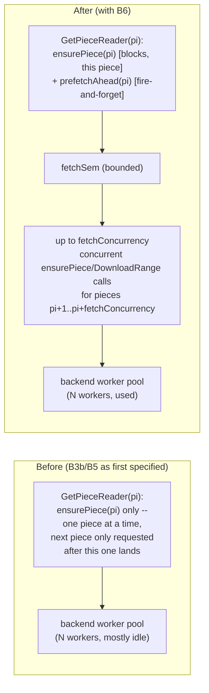

Every caller of `DownloadReader`/`GetPieceReader` benefits from the same
change — B5's whole-blob HTTP drain, the Range-read handler, and P2P piece
serving all go through `GetPieceReader`, so none of them needed a separate
fast path. Prefetch is driven directly from `GetPieceReader`, not from A7's
`streamReader.demand`/readahead signal: origin's `Torrent.HasPiece` always
returns `true` (B3a), so the `!HasPiece` branch that would call `demand` on
the reader side never fires for origin — that signal never reaches origin's
fetch path at all.

**Alternatives considered:**
- *Wire prefetch through A7's `streamReader.demand`/readahead window
  (the original design).* Rejected after tracing the actual call path —
  origin's `Torrent.HasPiece` is hardcoded `true`, so `acquirePiece`'s
  `demand()`-calling branch is dead code for origin. Driving prefetch from
  `GetPieceReader` itself is the only path every caller (whole-blob drain,
  Range handler, P2P piece serving) actually exercises.
- *A separate bulk-`Download()` path for whole-blob requests, bypassing the
  piece machinery entirely.* Rejected — it would special-case the common
  case instead of fixing the shared mechanism, leaving the Range-read handler
  and P2P piece-serving just as serial as before, and would need its own
  dedup/promotion logic parallel to B3a's cache short-circuit.
- *Unbounded concurrency (fire off `DownloadRange` for every wanted piece
  immediately).* Rejected — a single blob could exceed the backend worker
  pool's capacity, and many concurrent cold pulls across different blobs
  would compound; `fetchSem` bounds it per blob, and a per-origin cap across
  blobs is still open work (`production-plan.md` §12).

## 5. Tracker

### 5.1 Announce protocol / peer info

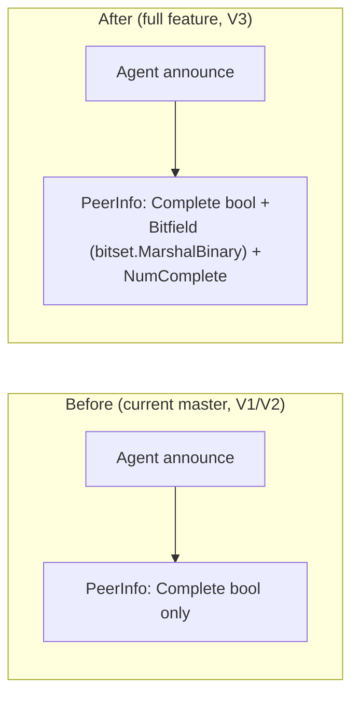

**Alternatives considered:**
- *Raw `[]bool` bitfield encoding.* Rejected — see §2.5.
- *Break the wire protocol instead of versioning it.* Rejected — V3 follows
  the existing V1/V2 additive-field, old-handler-leaves-it-nil scheme; no new
  versioning framework needed, and V1/V2 clients keep working unmodified.

### 5.2 Handout policy

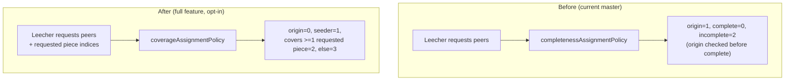

**Alternatives considered:**
- *Rank by exact count of covered pieces instead of coarse buckets.*
  Rejected (per D2's own verify-note in `production-plan.md`) — the existing
  `SortPeers` sorts on a single int priority; ranking by exact coverage count
  would require widening it to a `(priority, -covered)` tuple for a benefit
  not yet demonstrated to matter at cold-start scale. Coarse buckets keep the
  existing int-priority contract intact.
- *Make coverage-aware ranking the default instead of a new opt-in named
  policy.* Rejected — D2 ships as a new `coverage` policy name specifically
  so the existing `completeness`/`default` ordering's relative bucketing is
  preserved unless a cluster opts in via config.

## 6. Proxy

### 6.1 Blob client usage — unchanged

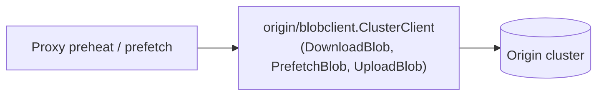

No PR in Stacks A, B, or D touches proxy code. A11 adds `DownloadBlobRange`
to the `Client`/`ClusterClient` interface proxy already depends on, but
proxy never calls it — nothing in this stack needs proxy to fetch a byte
range rather than a whole blob or manifest.

**Alternatives considered:** none proposed for proxy in this stack — noted
here rather than left silent, since the user-facing ask was for a diagram
per component including ones with no change, not just the ones that moved.

## 7. Build-index

### 7.1 Writeback executor

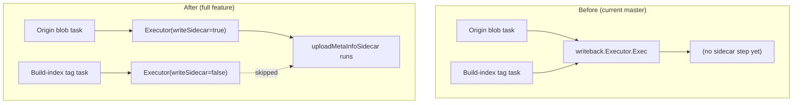

**Alternatives considered:** see §2.4.

## 8. Summary table

| Change | Component(s) | Duplication merge applied | Alternatives |
|---|---|---|---|
| `CAStore` gains `download` state | Origin | Yes — replaces `CADownloadStore` split | §7 preamble / B3 |
| `Refresher.TriggerBackground` | Origin | Yes — replaces two independent fetch engines | B5 |
| `DownloadBlobRange` client (A11) | Origin (client), Agent (caller) | Yes — reuses `Poll` | A11 |
| Shared `piecestate` package | Agent, Origin | Yes — new, this doc | §2.2 |
| Shared `retryOn202` helper | Origin, Tracker | Yes — new, this doc | §2.3 |
| `writeSidecar` gating (B2) | Origin, Build-index | N/A (regression fix, not duplication) | §2.4 |
| Bitfield wire format (D1) | Tracker, Agent | Yes — reuse `bitset.MarshalBinary` | §2.5 |
| Bounded concurrent piece prefetch (B6) | Origin | N/A (throughput fix, not duplication) | §4.4 |
| Piece-level memcache (B3c) | Origin | Yes — reuses existing `memCache` instance, disjoint key format | §4.1 |
| Coverage-aware handout (D2) | Tracker | No | §5.2 |
| Stream-aware priority classes (A12) | Agent | No — new, this doc | §3.3 |
| Proxy | Proxy | No — unchanged | §6.1 |
